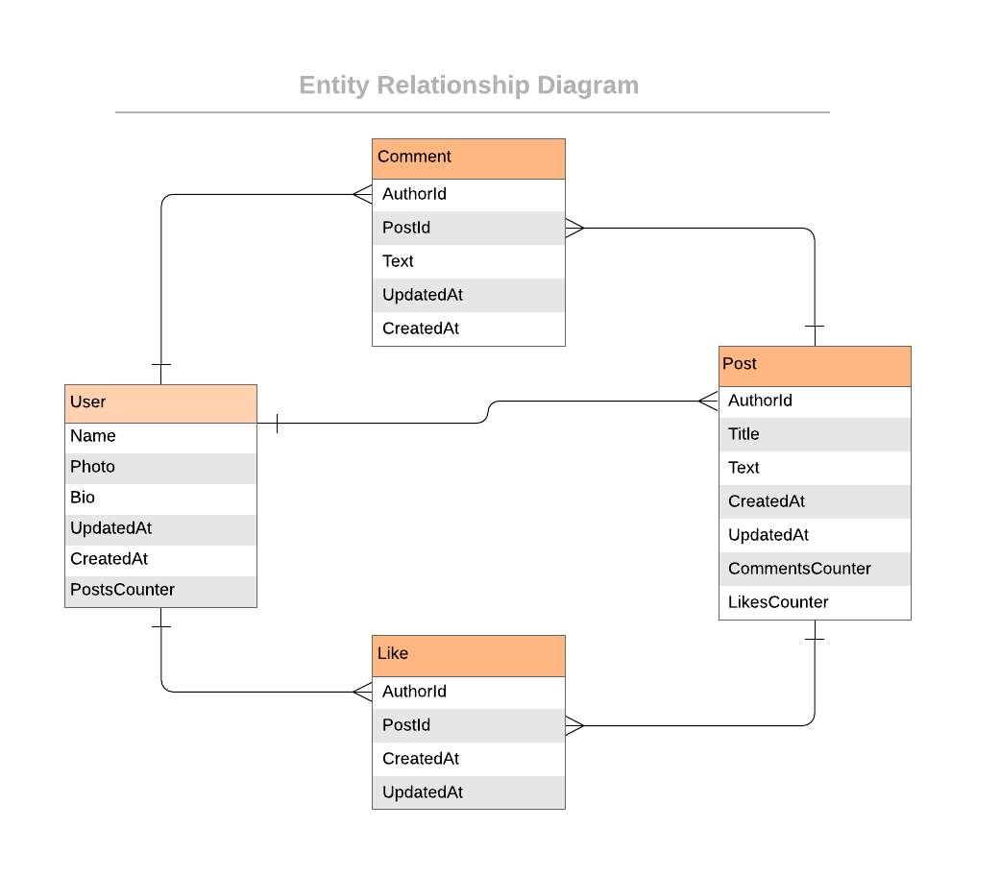

# 📗 Table of Contents

- [📖 About the Project](#about-project)
  - [🛠 Built With](#built-with)
    - [Tech Stack](#tech-stack)
    - [Key Features](#key-features)
  - [🚀 Live Demo](#live-demo)
- [💻 Getting Started](#getting-started)
  - [Setup](#setup)
  - [Prerequisites](#prerequisites)
  - [Install](#install)
  - [Usage](#usage)
  - [Run tests](#run-tests)
  - [Deployment](#triangular_flag_on_post-deployment)
- [👥 Authors](#authors)
- [🔭 Future Features](#future-features)
- [🤝 Contributing](#contributing)
- [⭐️ Show your support](#support)
- [🙏 Acknowledgements](#acknowledgements)
- [❓ FAQ (OPTIONAL)](#faq)
- [📝 License](#license)

# 📖 [ Blog app ]  
**[blog app ]** A sample blogging platform that allows you to create, manage, and publish content on the internet in the form of a blog.

ERDiagram:

## 🛠 Built With 
- Ruby on rails

### Tech Stack 

<

  
Client

  <ul>
    <li><a href="https://rubyonrails.org/">Rails</a></li>
  </ul>

  
Server

  <ul>
    <li><a href="https://www.ruby-lang.org/en/">Ruby</a></li>
  </ul>

Database

  <ul>
    <li><a href="https://www.postgresql.org/">PostgreSQL</a></li>
  </ul>

 

### Key Features 

- **User resource**
- **Comment resource**
- **Post resource**
- **Like resource**
- **Model validations**
- **Ability to add comments from the browser**
- **Ability to add posts from the browser**
- **Add likes to posts functionality**
- **Rspec tests**

(<a href="#readme-top">back to top</a>)

<!-- ## 🚀 Live Demo 
- [Live Demo Link]() -->

(<a href="#readme-top">back to top</a>)

## 💻 Getting Started 

To get a local copy up and running, follow these steps.

### Prerequisites
- A web browser e.g Chrome.
- Text Editor (VScode, Atom, Sublime text, etc)
- Basic knowledge of ruby
- Basic knowledge of RoR

In order to run this project you need:

 - install ruby
 - Install rails
 - Install postgresQl
 - Signup to Github

### Setup

Clone this repository to your desired folder:
> Command:

- `git clone git@github.com:Kasaija-Kenneth/blog-app.git`
- cd `blog-app`

### Install

- After opening the files in Visual Studio Code, open the VS Code integrated terminal and run the following commands:

> bundle init
> bundle install
> gem install rails

### Usage

- Run the command in your terminal below to run the ruby program

> run the `rails server` command in terminal
> run `http://localhost:3000` in the browser url
> update config/database.yml with your local DataBase credentials

### Run tests
- run `rspec` command to do spec_tests
- Run the `rubocop -A` command in your terminal for linter checks and corrections

### Deployment

You can deploy this project using:

(<a href="#readme-top">back to top</a>)

## 👥 Authors 

  👤 **Kasaija Kenneth**

  - GitHub: [@Kasaija-Kenneth](https://github.com/Kasaija-Kenneth)
  - LinkedIn: [LinkedIn](https://linkedin.com/in/kasaija-kenneth)
  - Twitter: [@kenn_ug](https://twitter.com/kenn_ug)
  - Email:  <a href="mailto:kasaijak@gmail.com?subject=The%20subject%20of%20the%20mail">Send me a message:</a>

  👤 **Recillah-Khamala**

  - GitHub: [@Recillah-Khamala](https://github.com/Recillah-Khamala)
  - Twitter: [@recillahk](https://twitter.com/recillahk)
  - LinkedIn: [LinkedIn](https://www.linkedin.com/in/recillah-khamala/) 
  

(<a href="#readme-top">back to top</a>)

## 🔭 Future Features 

> -[ ] **[ Add devise ]**

(<a href="#readme-top">back to top</a>)

## 🤝 Contributing 

Contributions, issues, and feature requests are welcome!

Feel free to check the [issues page](https://github.com/Kasaija-Kenneth/blog-app/issues).

(<a href="#readme-top">back to top</a>)

## ⭐️ Show your support 

> Write a message to encourage readers to support your project

If you like this project...

(<a href="#readme-top">back to top</a>)

## 🙏 Acknowledgments 

> Give credit to everyone who inspired your codebase.

I would like to thank...

(<a href="#readme-top">back to top</a>)

(<a href="#readme-top">back to top</a>)
 

## 📝 License 

This project is [MIT](https://github.com/Kasaija-Kenneth/blog-app/blob/controller_specs/MIT.md) licensed.

(<a href="#readme-top">back to top</a>)

